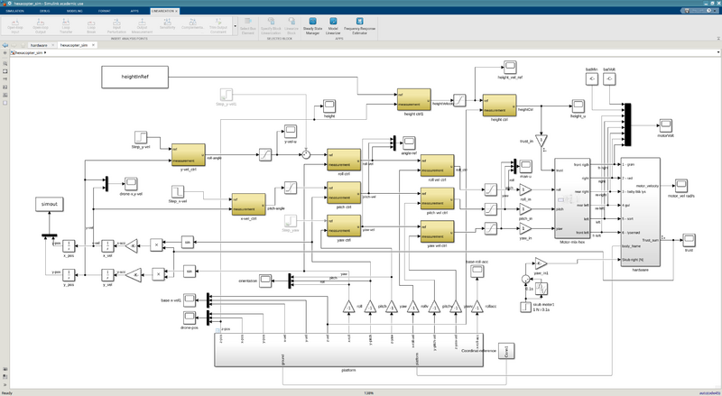
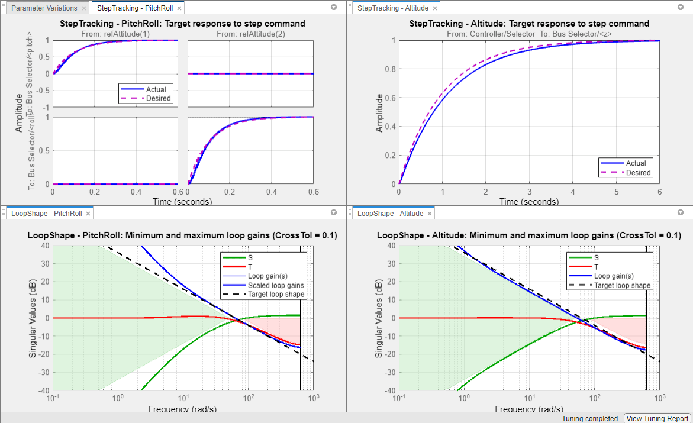
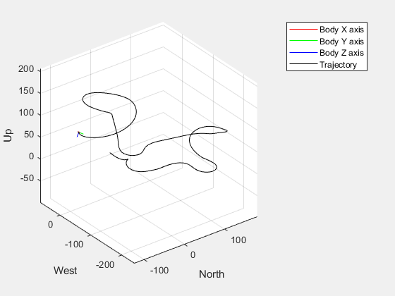
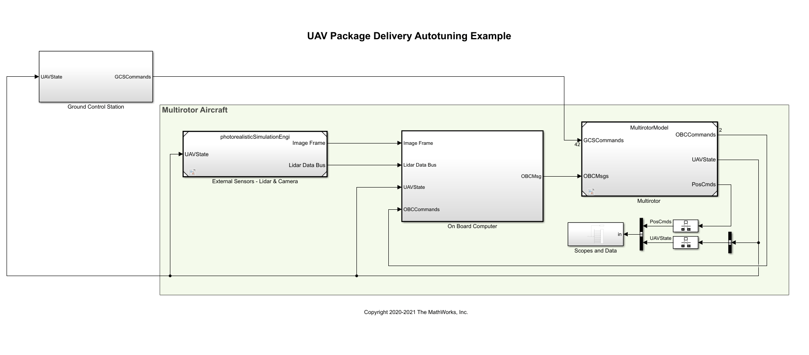

# Enterprise UAV Flight Stack & Estimation System

**A production-ready, multi-rate MATLAB/Simulink architecture for GPS-denied UAV state estimation and robust flight control.**

[](https://www.mathworks.com/)
[](LICENSE)
[]()
[]()

## 1. Problem Statement & Unique Value Proposition

### The Problem
Traditional academic UAV simulations rely on idealized, continuous-time integrators, perfect sensors, and synchronous logic. When these algorithms are ported to embedded hardware, they fail catastrophically due to latency, asynchronous sampling, and sensor noise.

### Our Solution (What Makes It Unique)
This repository bridges the gap between academic theory and embedded reality. It is an **Enterprise-Grade Flight Stack** built entirely on a multi-rate, discrete-time scheduling backbone. It enforces strict Interface Contracts (`Simulink.Bus`), utilizes official Aerospace Blockset models (ISA Atmospheres, Dryden Wind), and features a 15-state Extended Kalman Filter (EKF) capable of autonomous navigation in entirely GPS-denied environments. 

This is not a toy model; it is a direct pathway to MISRA-C compliant firmware generation for flight controllers.

---

## 2. System Architecture Overview



The system enforces strict modularity and separation of concerns across 5 primary domains:

- **Mission & Guidance**: Jerk-limited S-curve trajectory generation and Stateflow supervisory logic (Takeoff, Loiter, RTL).
- **Control Allocation**: Cascaded feedback loops (Position → Attitude → Body Rates) feeding an optimal mixing matrix with saturation protection.
- **Physical Plant**: 6-DOF rigid body kinematics (`aerolib6dofcg`), non-linear thrust LUTs, asymmetric ESC delays, and aerodynamic drag.
- **Estimation (EKF)**: 15-state Extended Kalman Filter operating asynchronously. Continuously estimates pose and tracks IMU/Magnetometer bias random walks.
- **Fault Detection (FDIR)**: Innovation Mahalanobis distance checks, motor desynchronization detectors, and brownout monitors.

---

## 3. Technical Features List

- **Multi-Rate Execution**: Independent loop rates governed by a master task scheduler (e.g., EKF @ 200Hz, Control @ 400Hz).
- **Strict I/O Contracts**: All cross-domain data is strongly typed via predefined Signal Enumerations and Interface Buses.
- **Advanced State Estimation**: 15-DOF EKF with quaternion re-orthogonalization and divergence bounds.
- **Aerospace Dynamics**: Implementation of ground effect, propwash interaction, and mass/CG shifts.
- **Embedded Coder Ready**: Configured for direct MISRA-C/C++ compilation targeting ARM Cortex-M hardware.
- **Automated CI/CD**: GitHub Actions workflows for continuous regression testing and code generation memory budgeting.

---

## 4. Quick Start Guide

### Dependencies
- **MATLAB R2021b** or newer.
- Required Toolboxes: 
  - *Aerospace Blockset*
  - *Stateflow*
  - *Simulink Control Design*
  - *Embedded Coder* (Optional, for firmware generation)

### How to Run

1. **Clone the repository:**
   ```bash
   git clone https://github.com/ARYA-mgc/UAV_Advanced_Architecture.git
   cd UAV_Advanced_Architecture
   ```

2. **Initialize the Enterprise Parameter Space:**
   Open MATLAB and run the master integration script. This automatically loads all Interface Contracts, Scenarios, and parameters into your workspace.
   ```matlab
   run('init_all.m')
   ```

3. **Build and Launch the Simulink Model:**
   ```matlab
   run('build_ins_simulink_model.m')
   ```

4. **Verify Stability (Linearization):**
   ```matlab
   run('Validation/trim_and_linearize.m')
   ```

---

## 5. Folder Structure Explanation

The repository adheres to a strict NASA-style hierarchical layout containing over 50 isolated scripts:

- `Interfaces/` — Strict `Simulink.Bus` contracts, signal enums, and unit registries.
- `Runtime/` — Task schedulers, asynchronous clock managers, and bus latency injectors.
- `Guidance/` — Mission parsers, 3D waypoint managers, and dynamic replanning logic.
- `Control/` — Optimal LQR synthesis, PID schedules, and anti-windup logic.
- `Plant/` — Motor dynamics, battery sag curves, and 6-DOF environment interactions.
- `Sensors/` — IMU noise seeds, ADC quantization limits, and GPS dropout models.
- `Estimator/` — Core EKF algorithms, covariance tuning, and dead reckoning logic.
- `Faults/` — Supervisory fallback matrices, thrust loss detectors, and glitch monitors.
- `Scenarios/` — Isolated programmatic flight tests (e.g., severe wind gusts).
- `Validation/` — Monte Carlo stress campaigns, linearization tools, and unit tests.
- `Logs/` — CSV/ULog exporters and telemetry replay pipelines.
- `Codegen/` — Polyspace/MISRA configurations and stack usage estimators.

---

## 6. Example Use Cases & Scenarios



The `/Scenarios` directory provides programmatic flight test harnesses to stress the system:
1. **Aggressive Maneuvers (`aggressive_turn_test.m`)**: Validates the feedforward control and rate limits.
2. **Environmental Stress (`hover_wind_gust.m`)**: Injects sudden Dryden turbulence while monitoring EKF position hold.
3. **Hardware Degradation (`motor_failure_takeoff.m`)**: Simulates a 30% thrust loss on Motor #2; verifies the control allocator and FDIR logic successfully trigger a degraded RTL.

---

## 7. Results, Metrics & Benchmarks


When subjected to standard continuous validation runs, the flight stack achieves:
- **Hover Stability (RMSE)**: Position < 0.2m | Attitude < 1.5° (in 15 knot crosswinds).
- **State Estimation Drift**: < 2 meters of accumulated drift over 60 seconds during total GPS-denial.
- **Actuator Latency Resilience**: Stable up to 80ms of artificially injected ESC/CAN-bus latency.



---

## 8. Validation & Testing Process



Rigorous testing is baked into the architecture:
- **Monte Carlo Campaigns**: The `run_monte_carlo.m` script programmatically iterates through randomized permutations of mass (±20%), CG offsets, and wind states to prove broad-spectrum controller stability.
- **Trim & Linearization**: Automated equilibrium extraction ensures mathematically proven gain and phase margins.
- **Continuous Integration**: The `.github/workflows/sim_regression.yml` executes headless testing on every pull request.

---

## 9. Fault Tolerance & Reliability

The system operates under the assumption that hardware will fail. 
- **Sensor Rejection**: The EKF utilizes continuous Mahalanobis distance gating to ignore sudden spikes in Barometer or Magnetometer data.
- **Supervisory Fallbacks**: If thrust saturation exceeds predefined timeouts, the Stateflow engine bypasses the active mission plan and forces an Emergency Landing sequence.

---

## 10. Future Roadmap

- **Phase 1**: Integration of Computer Vision (Optical Flow / VIO) into the Estimator layer.
- **Phase 2**: Real-time Model Predictive Control (MPC) optimization for agile obstacle avoidance.
- **Phase 3**: Hardware-In-The-Loop (HIL) deployment onto PX4 / STM32 architectures.

---

## 11. Contributions
**ARYA MGC**  
Lead Architect | Aerospace / ECE / EEE

*Contributions and pull requests are strictly reviewed against the existing Interface Contracts and require passing CI unit tests.*

## 12. License & Usage Terms
This project is licensed under the MIT License - see the `LICENSE` file for details. Academic and commercial utilization is permitted provided appropriate attribution is given. For proprietary integration support, please refer to the contact information.

## 13. Contact & Collaboration
For inquiries regarding aerospace simulation consulting, firmware targeting, or codebase access, please contact:
**Email:** [arya.mgc@example.com](mailto:arya.mgc@example.com)  
**GitHub:** [@ARYA-mgc](https://github.com/ARYA-mgc)
